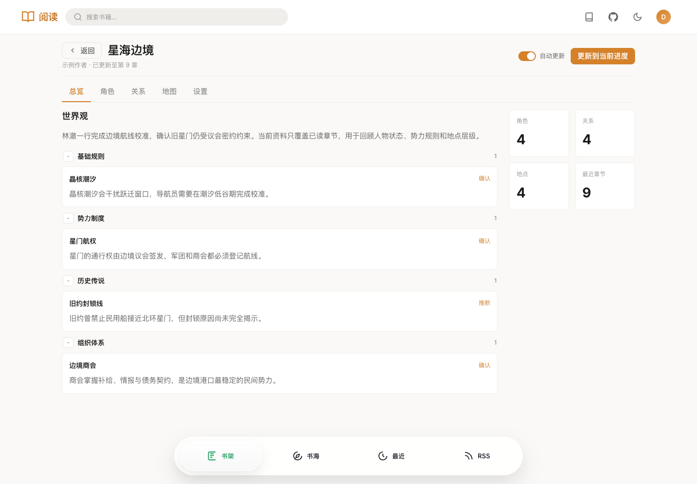
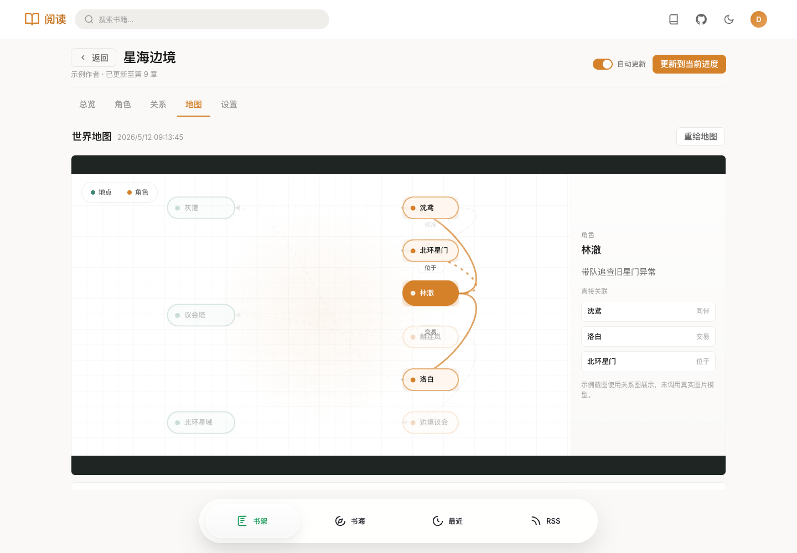
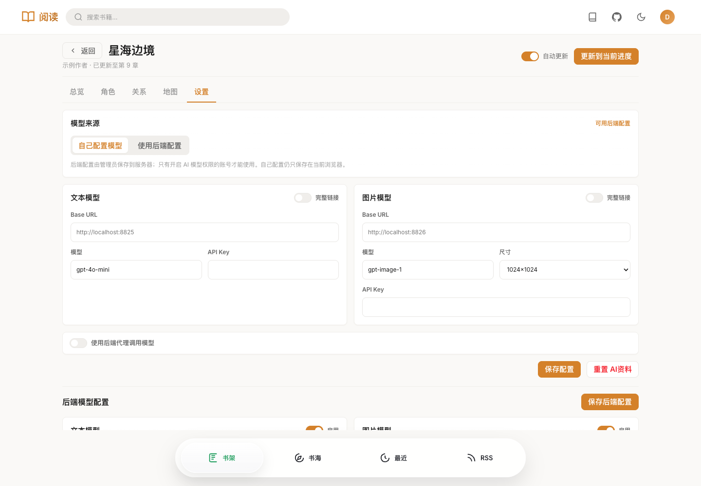

# AI资料

AI资料用于为书架中的小说维护一份随阅读进度更新的结构化资料。它会把已读章节整理成世界观、重要角色、人物关系和地点地图，方便长篇阅读时回顾信息。

::: warning 注意
AI资料只应处理已读章节。模型输出质量取决于所选模型、书源内容和章节质量，仍建议把它作为阅读辅助资料核对使用。
:::

## 入口

AI资料只对书架内的普通书籍开放，RSS 文章不会显示入口。

- 在书架书籍卡片上点击 **AI资料**
- 在书籍详情弹窗中点击 **AI资料**
- 阅读页工具栏点击 **AI资料**

打开后会进入当前书籍的 AI资料页面。

## 页面功能

### 总览

总览页展示当前书籍已更新到的阅读进度、剧情概览、世界观设定和资料统计。

- **世界观**：按基础规则、势力制度、历史传说、组织体系等分类归档。
- **角色统计**：显示当前资料中保留的重要角色数。
- **关系统计**：显示重要人物或角色-地点关系数。
- **地点统计**：显示已读进度内出现的重要地点数。
- **最近章节**：显示 AI资料已经处理到的章节序号。

### 角色

角色页会保留重要角色，并支持按角色名、别名、势力、当前位置搜索。每个角色包含状态、势力、位置、别名和最近出现章节等信息。

### 关系

关系页展示重要人物关系和人物-地点关联。低价值、一次性、重复的关系会尽量过滤，减少长篇阅读时的噪音。

### 地图

地图页优先展示图片模型生成的世界地图。图片生成失败或未配置图片模型时，会自动显示关系图作为降级视图。

地点列表会按层级展示，例如星域、城市、建筑等父子关系。重绘地图会重新调用图片模型；如果只更新了角色状态或普通关系，系统不会强制重绘地图。

### 设置

设置页管理当前账号的 AI资料模型来源。

## 模型配置

AI资料支持两种模型来源。

### 自己配置模型

自己配置的模型信息保存在当前浏览器中，适合个人使用。

需要配置：

| 项目 | 说明 |
|------|------|
| 文本模型 Base URL | OpenAI 兼容聊天接口服务地址 |
| 文本模型 | 用于整理世界观、角色、关系和地点 |
| 文本模型 API Key | 按服务要求填写，可为空 |
| 图片模型 Base URL | OpenAI 兼容图片生成接口服务地址 |
| 图片模型 | 用于重绘世界地图 |
| 图片尺寸 | 支持 `1024x1024`、`1792x1024`、`1024x1792` |
| 使用后端代理调用模型 | 开启后由 Reader-Rust 后端转发请求，避免浏览器直接跨域调用 |

如果你的模型服务已经提供完整接口地址，可以打开 **完整链接**，让 Base URL 按完整 URL 使用。

### 使用后端配置

后端配置由管理员保存到服务器，普通用户不会看到后端 API Key。只有管理员或被授权了 **AI 模型** 权限的账号才能使用后端配置。

管理员可以在 AI资料设置页底部维护：

- 文本模型
- 图片模型
- OpenAI Speech 语音模型

普通用户使用后端配置时，请先让管理员在 **用户管理** 中为该账号打开 **AI模型** 权限。

## 使用流程

1. 把书籍加入书架。
2. 打开书籍的 **AI资料** 页面。
3. 在 **设置** 中配置模型，或选择管理员提供的后端配置。
4. 点击 **更新到当前进度**，系统会从上次处理章节继续整理到当前阅读章节。
5. 打开 **自动更新** 后，后续阅读完成章节时会自动尝试更新。
6. 需要重新整理时，可以在设置页点击 **重置 AI资料**。

## 数据范围

- AI资料按用户和书籍隔离保存。
- 后端会要求目标书籍已经在当前用户书架中。
- 自动更新只会处理已读进度内的章节。
- 番外、上架感言、新书宣传等低价值章节会尽量跳过。

## 相关接口

AI资料页面主要使用这些后端接口：

| 接口 | 用途 |
|------|------|
| `GET/POST /reader3/getAiBookMemory` | 获取当前书籍 AI资料 |
| `POST /reader3/saveAiBookMemory` | 保存当前书籍 AI资料 |
| `POST /reader3/deleteAiBookMemory` | 重置当前书籍 AI资料 |
| `GET /reader3/getAiModelConfig` | 获取后端模型配置可见信息与权限状态 |
| `POST /reader3/saveAiModelConfig` | 管理员保存后端模型配置 |
| `POST /reader3/aiProxy` | 后端代理文本、图片、语音模型请求 |
| `POST /reader3/aiProxyImage` | 后端代理图片下载 |

## 常见问题

### 为什么看不到 AI资料入口？

确认书籍已经加入书架，并且不是 RSS 文章。搜索结果中的书籍需要先加入书架。

### 为什么不能使用后端配置？

当前账号没有 **AI 模型** 权限，或后端模型没有配置完整。请让管理员在用户管理中开启权限，并检查后端文本/图片模型是否启用。

### 为什么地图显示关系图而不是图片？

图片模型未配置、图片生成失败、接口不兼容或请求超时都会触发降级。此时页面会显示关系图，仍可用于查看角色、地点和关系。

### API Key 保存在哪里？

自己配置模型时，配置保存在当前浏览器。使用后端配置时，配置保存在服务器，非管理员接口不会返回密钥。
