# Reader-Rust 用户手册

## 目录
1. [系统简介](#系统简介)
2. [快速开始](#快速开始)
3. [安装PWA应用](#安装PWA应用)
4. [登录与账户](#登录与账户)
5. [书架管理](#书架管理)
6. [搜索书籍](#搜索书籍)
7. [书源管理](#书源管理)
8. [书海](#书海)
9. [最近阅读](#最近阅读)
10. [RSS](#RSS)
11. [用户管理](#用户管理)
12. [备份管理](#备份管理)
13. [阅读功能](#阅读功能)
14. [快捷键](#快捷键)
15. [常见问题](#常见问题)
16. [技术信息](#技术信息)
17. [获取帮助](#获取帮助)

---

## 系统简介

Reader-Rust 是一个用 Rust 实现的书源阅读服务器，提供 Web 前端界面，支持多书源搜索、在线阅读、书架管理等功能。

### 主要特性

- **多书源支持**：支持导入多种书源，实现全网书籍搜索
- **在线阅读**：支持章节阅读、字体调节、主题切换
- **书架管理**：收藏喜欢的书籍，支持分组管理
- **阅读进度同步**：自动保存阅读进度
- **PWA 支持**：可安装为桌面应用，支持离线阅读

---

## 快速开始

### 访问系统

在浏览器中输入地址访问 Reader-Rust：
```
https://reader.grandy.fun
```

---

## 安装PWA应用

### 什么是PWA应用

渐进式Web 应用 (PWA) 是使用 Web 技术生成的应用程序，可以从一个代码库安装并可在所有设备上运行。

PWA 在支持设备上为用户提供类似于本机的体验。 它们适应每个设备支持的功能，还可以在 Web 浏览器（如网站）中运行。

### 安装

点击右上角的头像或设置，找到应用-安装到主屏幕，部分浏览器和ios不支持pwa应用，可以选择自带的添加到主屏幕

---
## 登录与账户

### 登录系统

1. 点击页面右上角的"登录"按钮
2. 在弹出的登录框中输入用户名和密码

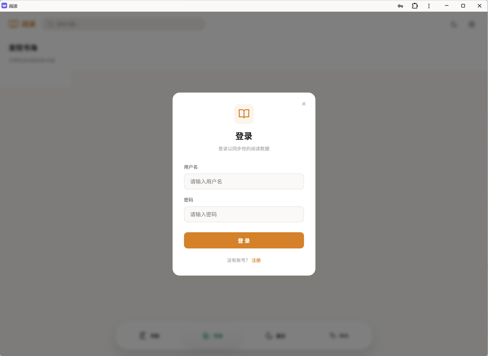

3. 点击"登录"按钮完成登录

### 登录后的界面

登录成功后，默认进入书架页，页面右上角会显示当前登录的用户名，点击用户名可以进入设置，旁边按钮切换日间/夜间模式。

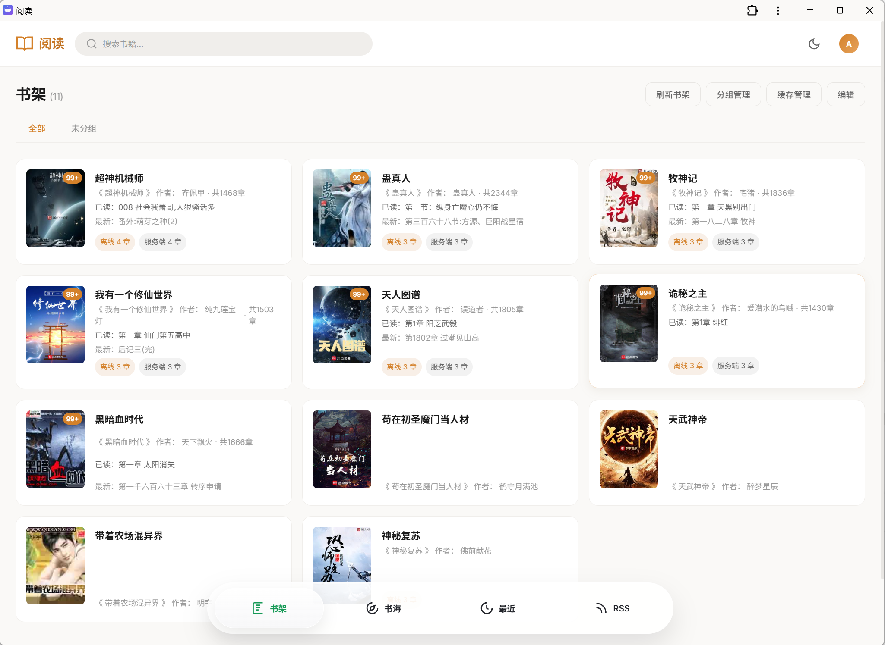
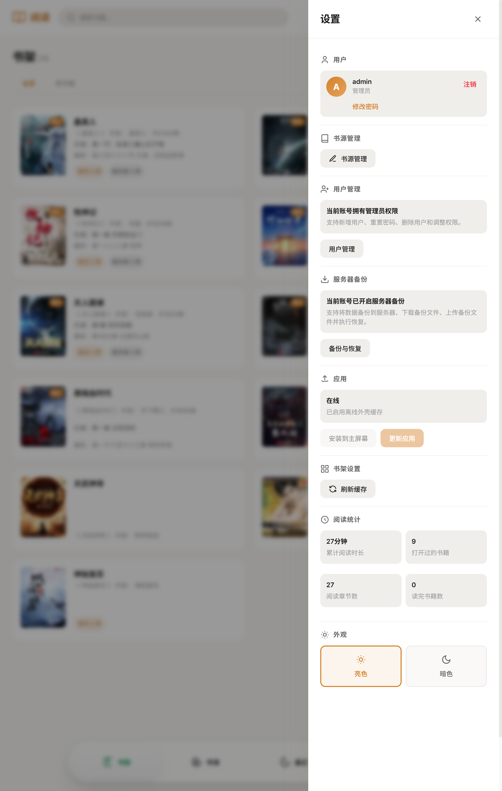

---

## 书架管理

### 查看书架

登录后，点击左侧导航栏的"书架"图标，可以查看已添加的书籍列表。

书架功能包括：
- **书籍展示**：以卡片形式展示书籍封面和基本信息，点击封面展示详细信息
- **分组管理**：支持创建分组，将书籍分类存放
- **书籍排序**：默认按照最近阅读排序，可以长按拖动书籍卡片改变排序
- **缓存管理**：支持管理浏览器和服务器缓存

### 添加书籍到书架

在搜索功能或者书海中加入书架

### 管理书架

- **编辑模式**：点击编辑按钮进入批量管理模式
- **删除书籍**：选择书籍后点击删除
- **移动分组**：将书籍移动到不同分组

### 缓存管理

- **缓存到服务器/浏览器**：可选缓存50章，100章或者全部缓存。
- **删除缓存**：从服务器/浏览器删除缓存

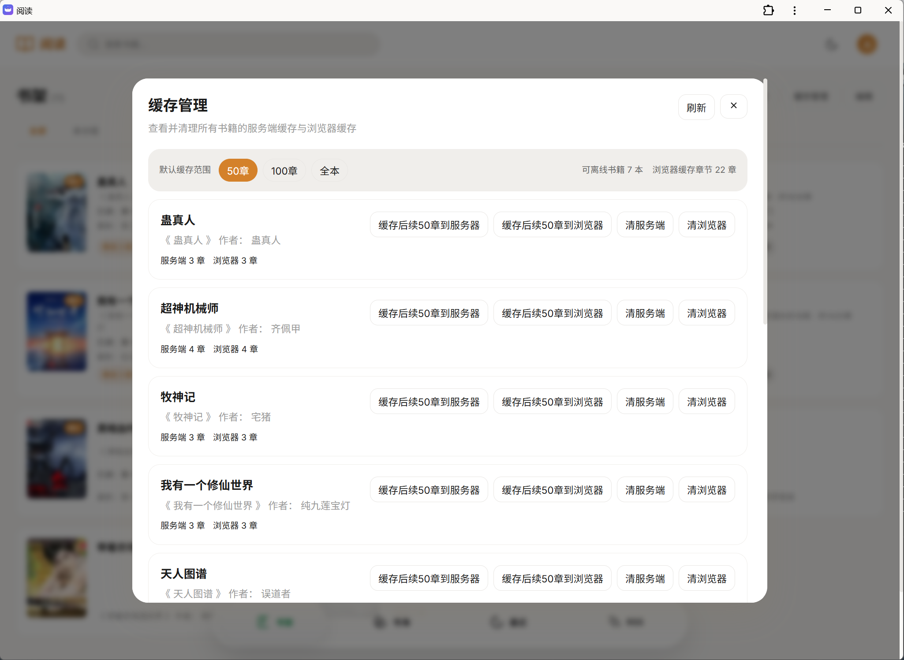

---

## 搜索书籍

### 使用搜索功能

Reader-Rust 支持多书源同时搜索，帮助您快速找到想看的书籍。

1. 在首页或书架页面找到搜索框
2. 输入书名、作者名或关键词
3. 按回车键或点击搜索按钮开始搜索

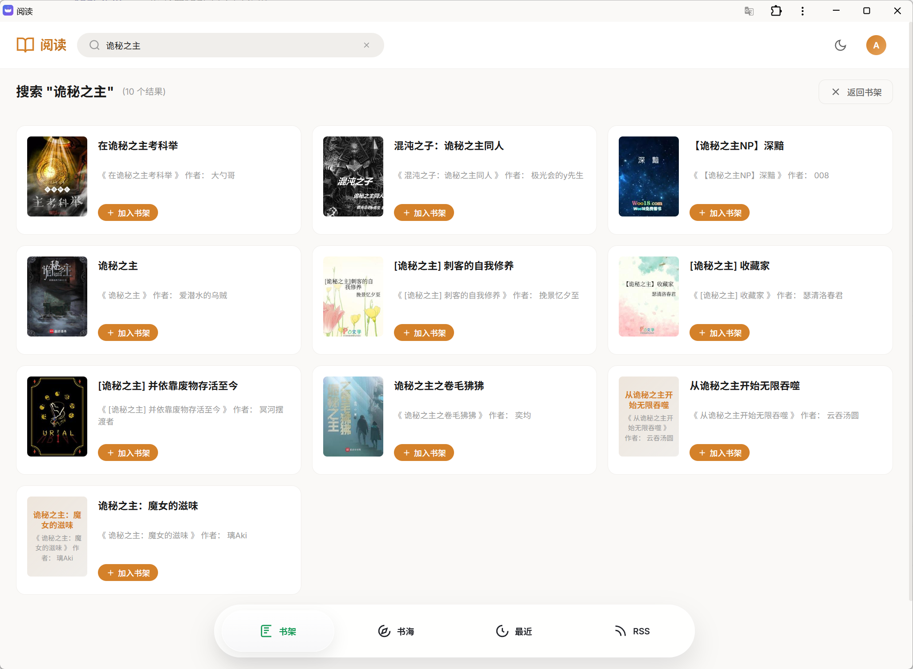

### 搜索结果说明

搜索结果会显示来自多个书源的书籍，书名和作者名都相同的书会被合并成一本书多书源：
- **书名**：书籍标题
- **作者**：作者名称
- **操作**：加入书架或者直接阅读

### 搜索技巧

- 使用精确的书名可以获得更准确的搜索结果
- 支持作者名搜索（需书源支持）
- 搜索结果会实时显示，来自不同书源的结果会陆续出现

---

## 书源管理

### 什么是书源

书源是 Reader-Rust 用来搜索和获取书籍内容的配置。通过添加不同的书源，可以扩展系统的书籍搜索能力。

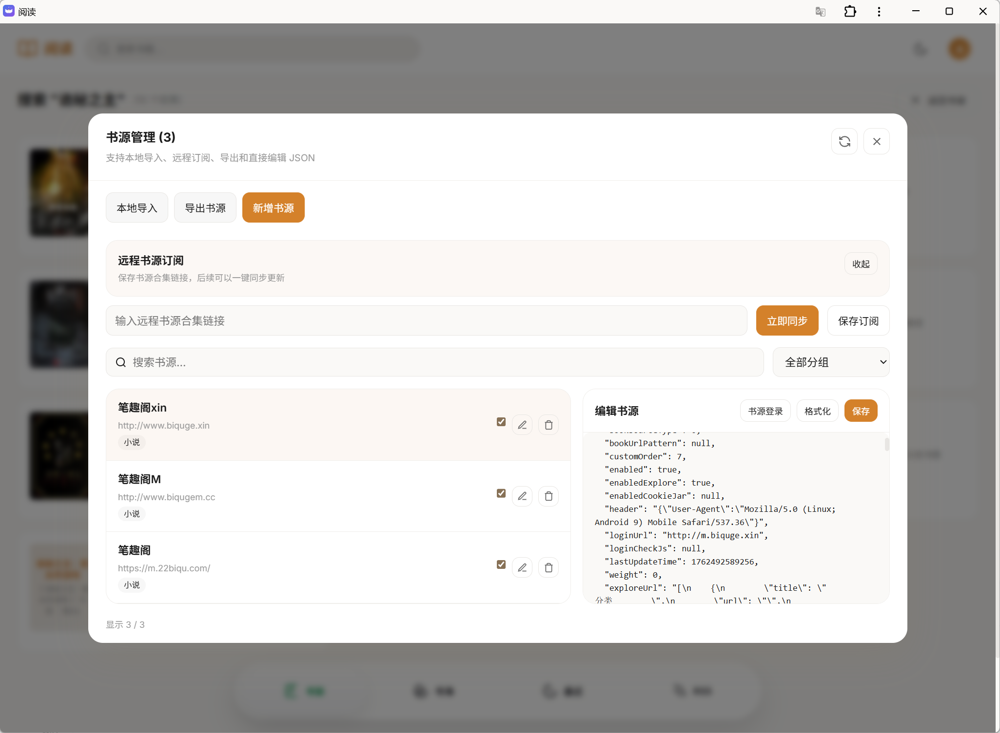

### 打开书源管理

点击左侧导航栏的"书源"按钮，打开书源管理界面。

### 添加书源

#### 从 URL 导入
1. 获取书源 JSON 文件的 URL
2. 在书源管理界面点击"导入"
3. 选择"从网络导入"
4. 粘贴书源 URL 并确认

#### 本地导入
1. 准备好书源 JSON 文件
2. 在书源管理界面点击"导入"
3. 选择"从文件导入"
4. 选择本地书源文件

### 管理书源

- **启用/禁用**：控制书源是否参与搜索
- **分组筛选**：按分组查看书源
- **删除书源**：移除不需要的书源
- **编辑书源**：在线编辑json,需要登录的书源，先点击编辑，然后点书源登录


---

## 书海

### 什么是书海

书海是根据不同书源的分类配置，展示该书源的书籍信息

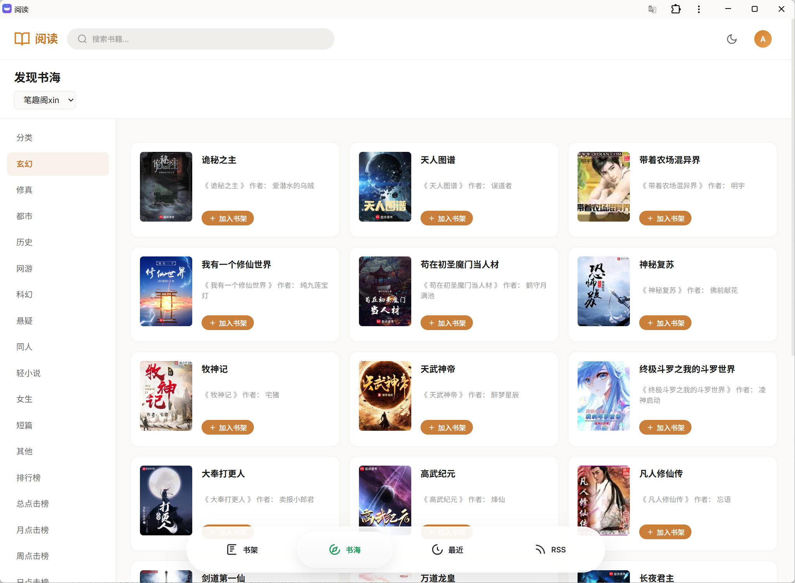


---

## 最近阅读

按阅读时间前后展示书籍列表，主要用于找到从书海或者搜索结果阅读但未加入书架的书籍，可以单个删除或者清除所有。

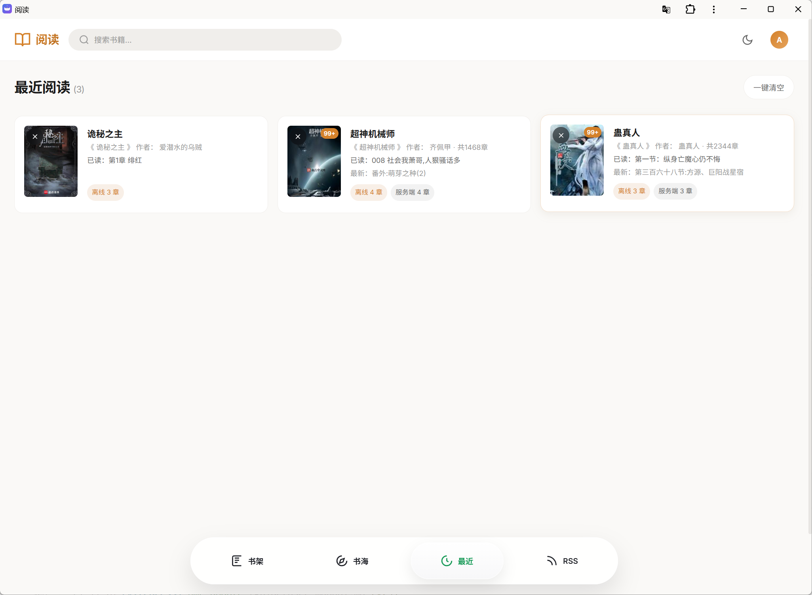


---

## RSS

实验性功能

---

## 用户管理
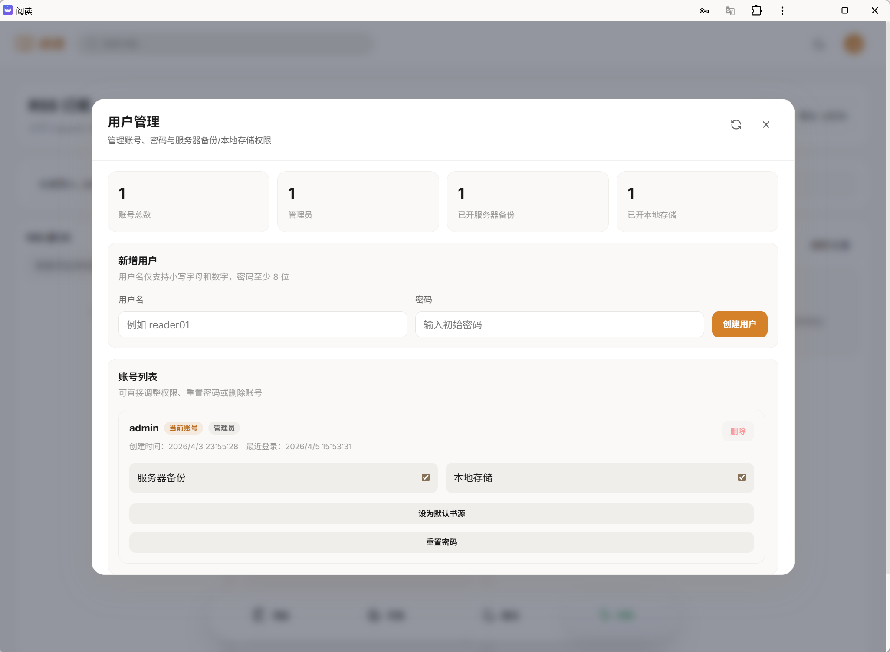
- 添加删除用户，管理用户密码
- 管理用户服务器备份功能
- 设为默认书源：设置后，后续新增的用户会默认添加改用户的书源

---

## 备份管理
在用户管理中添加备份权限后才能使用
可以备份/恢复书架，书源等信息
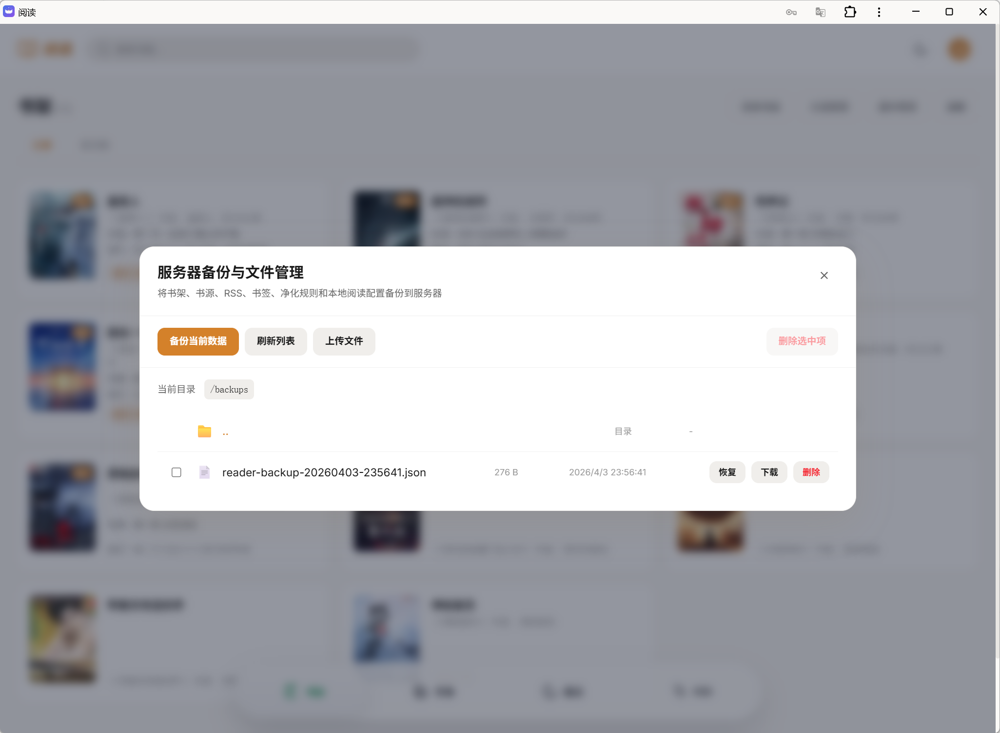


---

## 阅读功能

### 开始阅读

1. 在书架中点击想要阅读的书籍
2. 或者在搜索结果/书海中点击书籍开始阅读

### 阅读界面

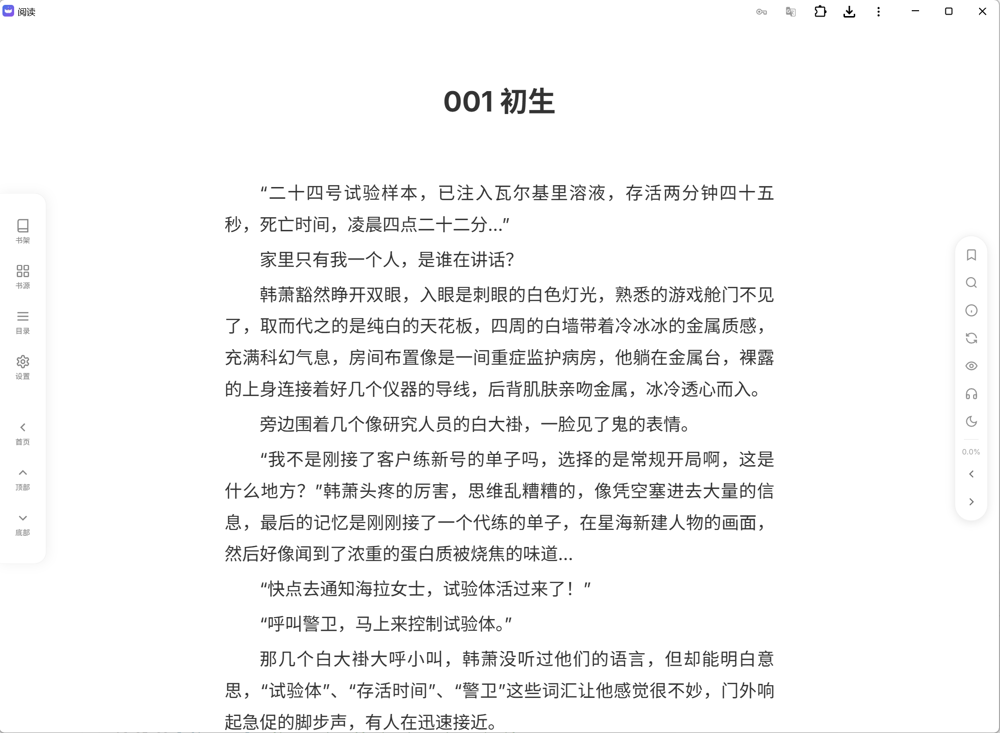

阅读界面提供丰富的阅读功能：

#### 基本操作
- **翻页**：点击屏幕左右两侧或滑动翻页
- **目录**：点击左侧按钮打开章节目录，点击刷新按钮无视缓存从书源重新获取
- **进度**：显示当前阅读进度
- **刷新**：无视缓存从重新从书源获取章节内容

---

## 快捷键

| 快捷键 | 功能 |
|--------|------|
| ← / PageUp | 上一页 |
| → / PageDown | 下一页 |
| Home | 章节开头 |
| End | 章节结尾 |
| Esc | 关闭弹窗/退出阅读 |
| Space | 向下翻页 |

#### 阅读设置
点击屏幕中央或设置按钮，可以调整：

**字体设置**
- 字体大小：A- / A+ 调节
- 字体粗细：- / + 调节，或者输入数字

**段落设置**
- 段落行高：- / + 调节
- 段落间距：- / + 调节

**主题设置**
- 亮色模式：白底黑字
- 暗色模式：黑底白字

**阅读宽度**
- 调节阅读区域的宽度，适应不同屏幕

**翻页方式**
- 上下滑动 
- 左右滑动
- 上下滚动 无缝衔接下一章
- 上下滚动2 隐藏已读章节

#### 高级功能

**书签管理**
- 添加书签：在阅读位置添加标记
- 查看书签：列出所有书签位置
- 删除书签：管理已添加的书签

**章节导航**
- 上一章/下一章快速切换
- 章节目录树形展示，支持搜索
- 快速跳转到指定章节

**自动阅读**
- 设置按段落或者像素移动
- 调节移动速度

**内容过滤**
- 支持自定义替换规则 

    添加方法

    1.打开选择文字的操作按钮，选中文字后可以按书添加规则，或者按书源添加规则。

    2.打开设置->管理净化规则->新增规则
- 简繁体转换

**听书功能**
- 支持文字转语音
- 可使用浏览器自带TTS或者配置OpenAi格式的Speech Api

    浏览器TTS推荐使用edge，edge接入了azure的接口，TTS效果最佳

- 可调节语速
- 可调节音色
- 支持定时关闭


---


## 常见问题

### Q: 无法登录怎么办？
A: 请检查：
1. 用户名和密码是否正确
2. 服务器是否正常运行
3. 网络连接是否正常

### Q: 搜索不到书籍？
A: 请尝试：
1. 检查是否已添加书源
2. 尝试不同的关键词
3. 检查书源是否可用

### Q: 阅读时加载慢？
A: 建议：
1. 检查网络连接
2. 尝试切换书源
3. 清理缓存后重试

### Q: 如何备份数据？
A: 可以通过以下方式备份：
1. 使用系统设置中的"服务端备份"功能
2. 配置 WebDAV 自动同步
3. 导出书源和书架数据


---

## 技术信息

- **前端技术**：Vue 3 + TypeScript + Vite
- **后端技术**：Rust + Axum
- **数据库**：SQLite
- **支持的解析器**：CSS选择器、JSONPath、XPath、正则、JavaScript

---

## 获取帮助

如遇到问题，可以通过以下方式获取帮助：
1. 查看系统日志
2. 检查浏览器控制台错误信息
3. 联系系统管理员

---

*文档版本：1.0*
*最后更新：2026-04-05*
